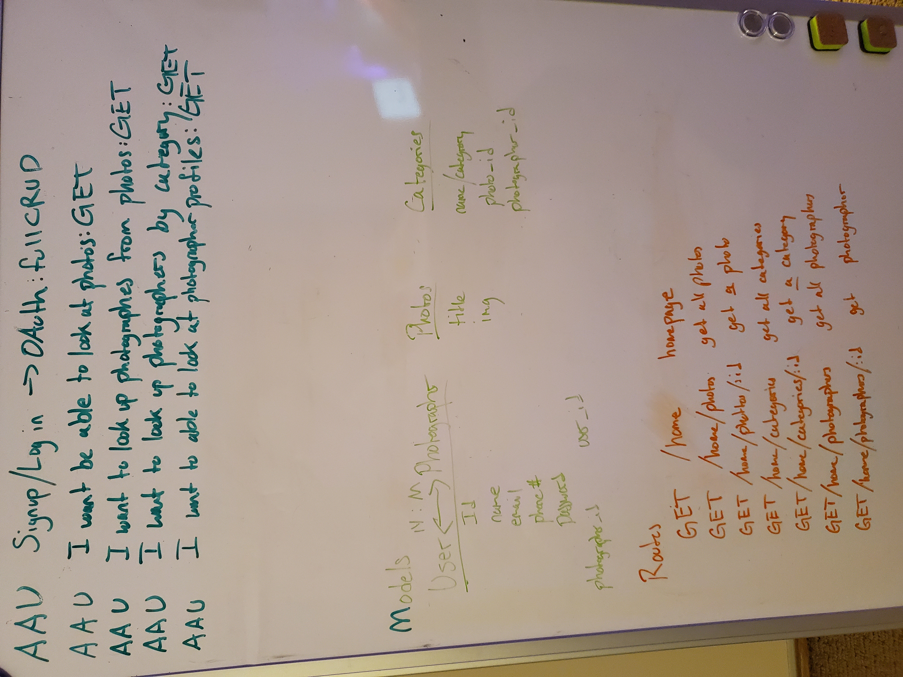

# ThePhoto- a connection app

## Table of contents
* [General Info] (#general-info)
* [Technologies] (#technologies)
* [Journal] (#journal)

## General info
an app to connect you, the user, to a photographer

## Technologies
This Project is created with:
* MongoDB
* Mongoose
* Express.js
* React
* Node.js
* Axios
* Material-UI

## Journal
### Day 1/ Day 2
I planned my routes and model schemas, determined the relationships between
my models and made my User stories.

### Day 4
Finished writing my routes

I also started working on my react components and making the react carousel component.

### Day 5
Finished working on my front end, had a really hard time with cloudinary and
in the end was unable to use it in my project, but I have set it as a goal to
incorperate in my app post cohort as one of my main stretch goals.

## Achknowlegments
Thank you to Steve Peters and Sarah King in being great teachers who helped us whenever I needed it, also to Sarah Brink who gave me the idea for this app.